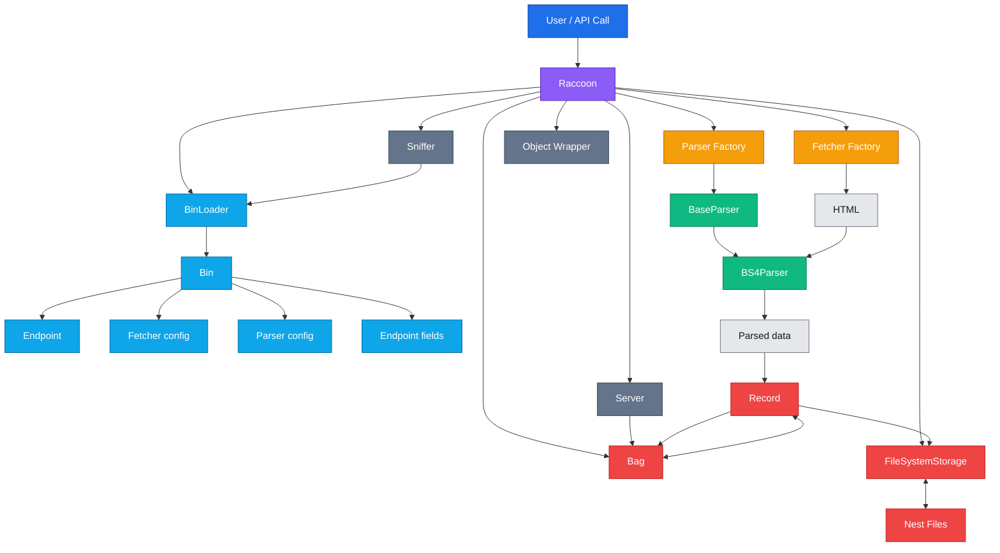

# Architecture

```mermaid
flowchart TD
    %% Color legend
    classDef entry fill:#1f6feb,stroke:#0d3b99,color:#ffffff
    classDef orchestrator fill:#8b5cf6,stroke:#5b21b6,color:#ffffff
    classDef config fill:#0ea5e9,stroke:#0369a1,color:#ffffff
    classDef runtime fill:#f59e0b,stroke:#b45309,color:#ffffff
    classDef parser fill:#10b981,stroke:#047857,color:#ffffff
    classDef storage fill:#ef4444,stroke:#b91c1c,color:#ffffff
    classDef service fill:#64748b,stroke:#334155,color:#ffffff
    classDef data fill:#e5e7eb,stroke:#6b7280,color:#111827

    U[User / API Call] --> R[Raccoon]

    R --> BL[BinLoader]
    BL --> B[Bin]
    B --> E[Endpoint]

    R --> F[Fetcher Factory]
    R --> P[Parser Factory]
    P --> BP[BaseParser]
    BP --> BS[BS4Parser]

    R --> BAG[Bag]
    R --> FS[FileSystemStorage]
    FS <--> N[Nest Files]
    BAG <--> REC[Record]

    R --> SN[Sniffer]
    SN --> BL

    R --> SV[Server]
    SV --> BAG

    R --> OBJ[Object Wrapper]

    B --> FCONF[Fetcher config]
    B --> PCONF[Parser config]
    B --> EPCONF[Endpoint fields]

    F --> HTML[HTML]
    HTML --> BS
    BS --> DATA[Parsed data]
    DATA --> REC
    REC --> BAG
    REC --> FS

    class U entry
    class R orchestrator
    class BL,B,E,FCONF,PCONF,EPCONF config
    class F,P runtime
    class BP,BS parser
    class BAG,FS,N,REC storage
    class SN,SV,OBJ service
    class HTML,DATA data
```