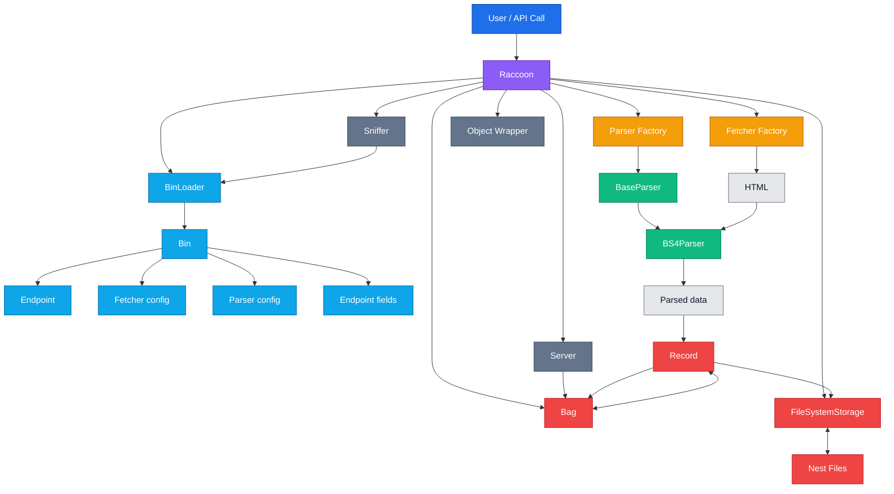
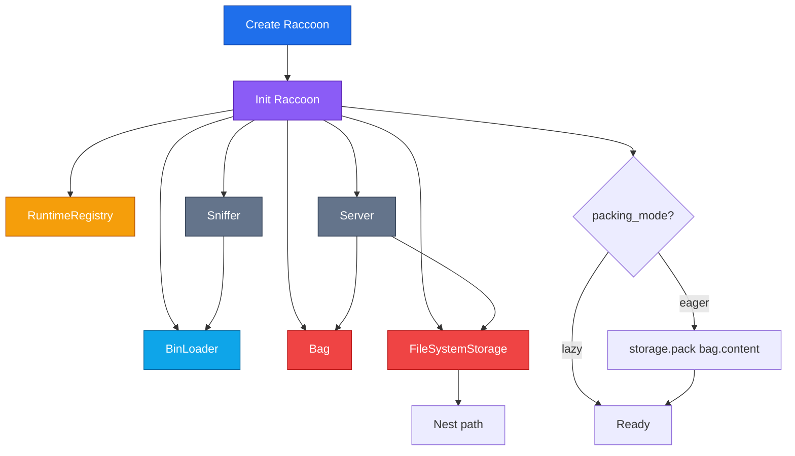
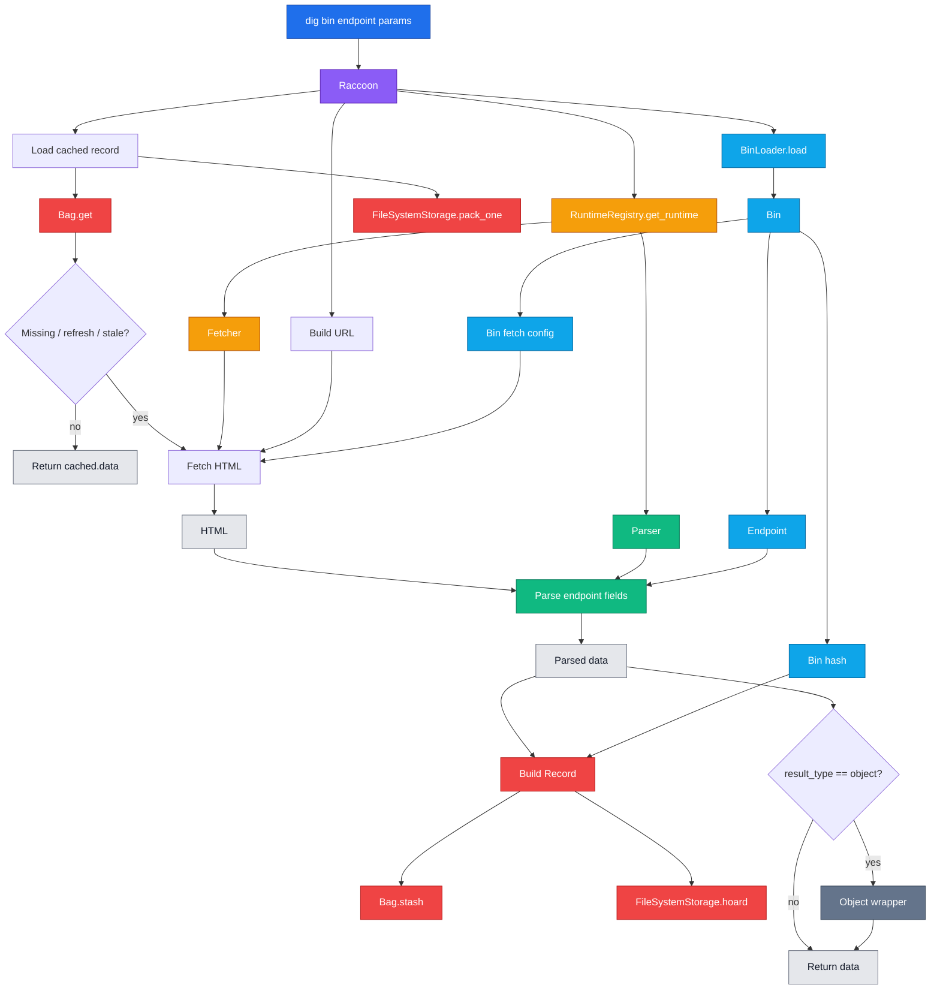
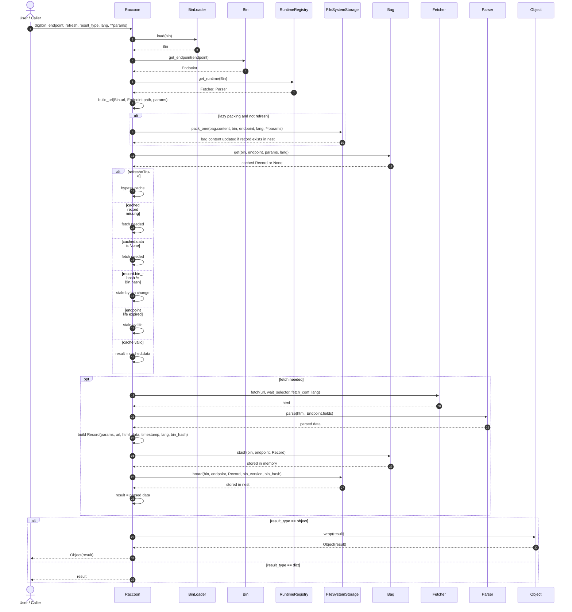
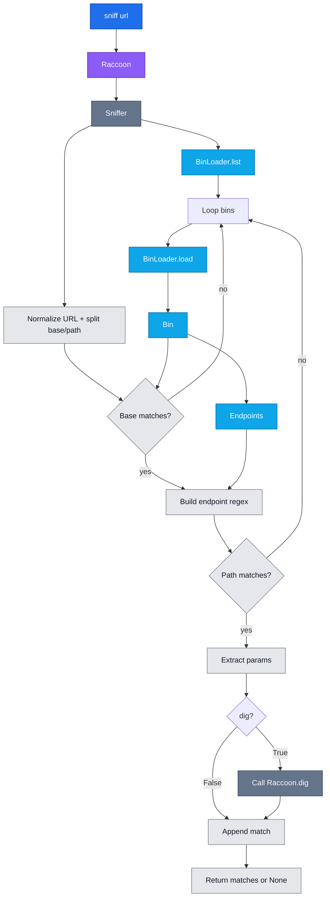
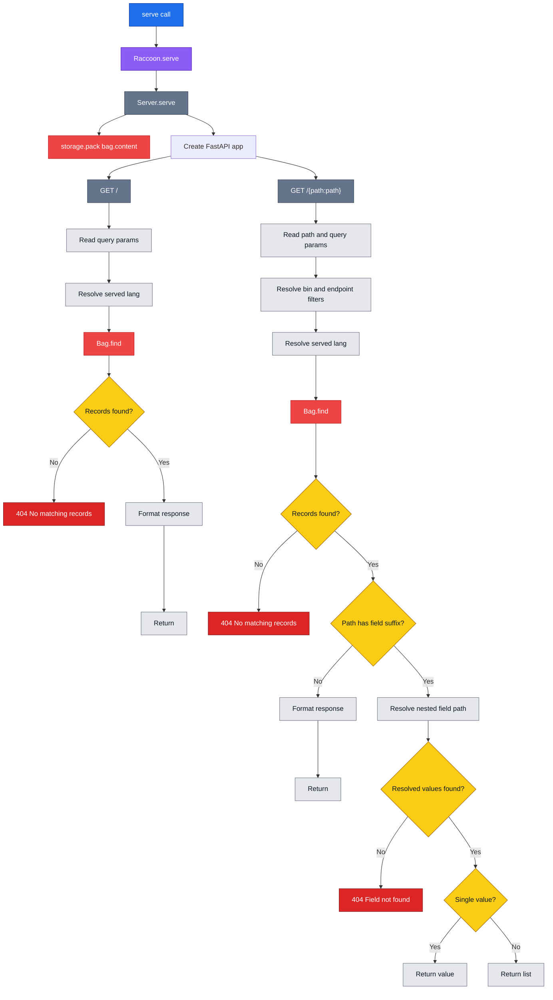
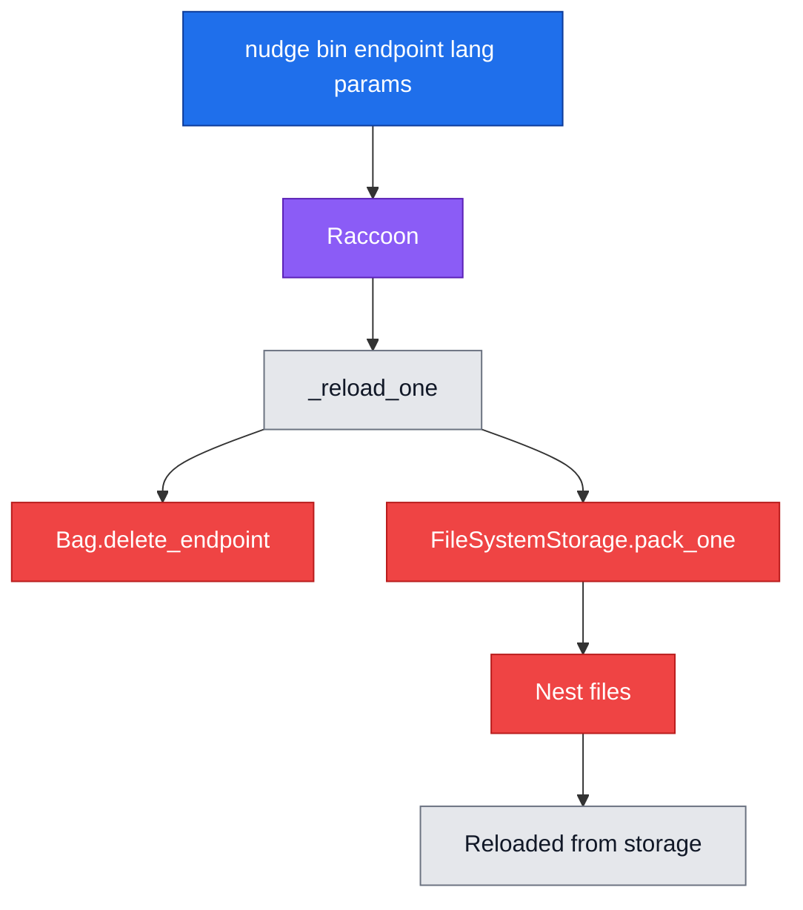

# Architecture

```mermaid
flowchart TD
    %% Color legend
    classDef entry fill:#1f6feb,stroke:#0d3b99,color:#ffffff
    classDef orchestrator fill:#8b5cf6,stroke:#5b21b6,color:#ffffff
    classDef config fill:#0ea5e9,stroke:#0369a1,color:#ffffff
    classDef runtime fill:#f59e0b,stroke:#b45309,color:#ffffff
    classDef parser fill:#10b981,stroke:#047857,color:#ffffff
    classDef storage fill:#ef4444,stroke:#b91c1c,color:#ffffff
    classDef service fill:#64748b,stroke:#334155,color:#ffffff
    classDef data fill:#e5e7eb,stroke:#6b7280,color:#111827

    U[User / API Call] --> R[Raccoon]

    R --> BL[BinLoader]
    BL --> B[Bin]
    B --> E[Endpoint]

    R --> F[Fetcher Factory]
    R --> P[Parser Factory]
    P --> BP[BaseParser]
    BP --> BS[BS4Parser]

    R --> BAG[Bag]
    R --> FS[FileSystemStorage]
    FS <--> N[Nest Files]
    BAG <--> REC[Record]

    R --> SN[Sniffer]
    SN --> BL

    R --> SV[Server]
    SV --> BAG

    R --> OBJ[Object Wrapper]

    B --> FCONF[Fetcher config]
    B --> PCONF[Parser config]
    B --> EPCONF[Endpoint fields]

    F --> HTML[HTML]
    HTML --> BS
    BS --> DATA[Parsed data]
    DATA --> REC
    REC --> BAG
    REC --> FS

    class U entry
    class R orchestrator
    class BL,B,E,FCONF,PCONF,EPCONF config
    class F,P runtime
    class BP,BS parser
    class BAG,FS,N,REC storage
    class SN,SV,OBJ service
    class HTML,DATA data
```

## `__init__`

### Flowchart

```mermaid
flowchart TD
    classDef entry fill:#1f6feb,stroke:#0d3b99,color:#ffffff
    classDef orchestrator fill:#8b5cf6,stroke:#5b21b6,color:#ffffff
    classDef config fill:#0ea5e9,stroke:#0369a1,color:#ffffff
    classDef runtime fill:#f59e0b,stroke:#b45309,color:#ffffff
    classDef storage fill:#ef4444,stroke:#b91c1c,color:#ffffff
    classDef service fill:#64748b,stroke:#334155,color:#ffffff

    A[Create Raccoon] --> B[Init Raccoon]
    B --> BL[BinLoader]
    B --> RR[RuntimeRegistry]
    B --> BAG[Bag]
    B --> FS[FileSystemStorage]
    B --> SN[Sniffer]
    B --> SV[Server]

    FS --> NP[Nest path]
    SN --> BL
    SV --> BAG
    SV --> FS

    B --> PM{packing_mode?}
    PM -- eager --> FS2[storage.pack bag.content]
    PM -- lazy --> DONE[Ready]

    FS2 --> DONE

    class A entry
    class B orchestrator
    class BL config
    class RR runtime
    class BAG,FS storage
    class SN,SV service
```

## `dig`

### Flowchart

```mermaid
flowchart TD
    classDef entry fill:#1f6feb,stroke:#0d3b99,color:#ffffff
    classDef orchestrator fill:#8b5cf6,stroke:#5b21b6,color:#ffffff
    classDef config fill:#0ea5e9,stroke:#0369a1,color:#ffffff
    classDef runtime fill:#f59e0b,stroke:#b45309,color:#ffffff
    classDef parser fill:#10b981,stroke:#047857,color:#ffffff
    classDef storage fill:#ef4444,stroke:#b91c1c,color:#ffffff
    classDef service fill:#64748b,stroke:#334155,color:#ffffff
    classDef data fill:#e5e7eb,stroke:#6b7280,color:#111827

    U[dig bin endpoint params] --> R[Raccoon]

    R --> BL[BinLoader.load]
    BL --> B[Bin]
    B --> E[Endpoint]

    R --> RR[RuntimeRegistry.get_runtime]
    RR --> F[Fetcher]
    RR --> P[Parser]

    R --> URL[Build URL]

    R --> CL[Load cached record]
    CL --> FS[FileSystemStorage.pack_one]
    CL --> BAG[Bag.get]

    BAG --> STALE{Missing / refresh / stale?}
    STALE -- no --> CACHED[Return cached.data]

    STALE -- yes --> FETCH[Fetch HTML]
    F --> FETCH
    URL --> FETCH
    B --> FETCHCONF[Bin fetch config]
    FETCHCONF --> FETCH

    FETCH --> HTML[HTML]
    HTML --> PARSE[Parse endpoint fields]
    P --> PARSE
    E --> PARSE
    PARSE --> DATA[Parsed data]

    DATA --> REC[Build Record]
    B --> HASH[Bin hash]
    HASH --> REC

    REC --> BAGS[Bag.stash]
    REC --> HOARD[FileSystemStorage.hoard]

    DATA --> OBJ{result_type == object?}
    OBJ -- yes --> WRAP[Object wrapper]
    OBJ -- no --> RET[Return data]
    WRAP --> RET

    class U entry
    class R orchestrator
    class BL,B,E,FETCHCONF,HASH config
    class RR,F runtime
    class P,PARSE parser
    class BAG,FS,REC,HOARD,BAGS storage
    class WRAP service
    class HTML,DATA,CACHED,RET data
```

### Sequence Diagram

```mermaid
sequenceDiagram
    autonumber
    actor U as User / Caller
    participant R as Raccoon
    participant BL as BinLoader
    participant B as Bin
    participant RR as RuntimeRegistry
    participant FS as FileSystemStorage
    participant BAG as Bag
    participant F as Fetcher
    participant P as Parser
    participant OBJ as Object

    U->>R: dig(bin, endpoint, refresh, result_type, lang, **params)

    R->>BL: load(bin)
    BL-->>R: Bin
    R->>B: get_endpoint(endpoint)
    B-->>R: Endpoint

    R->>RR: get_runtime(Bin)
    RR-->>R: Fetcher, Parser

    R->>R: build_url(Bin.url, Endpoint.path, params)

    alt lazy packing and not refresh
        R->>FS: pack_one(bag.content, bin, endpoint, lang, **params)
        FS-->>R: bag content updated if record exists in nest
    end

    R->>BAG: get(bin, endpoint, params, lang)
    BAG-->>R: cached Record or None

    alt refresh=True
        R->>R: bypass cache
    else cached record missing
        R->>R: fetch needed
    else cached.data is None
        R->>R: fetch needed
    else record.bin_hash != Bin.hash
        R->>R: stale by bin change
    else endpoint life expired
        R->>R: stale by life
    else cache valid
        R->>R: result = cached.data
    end

    opt fetch needed
        R->>F: fetch(url, wait_selector, fetch_conf, lang)
        F-->>R: html

        R->>P: parse(html, Endpoint.fields)
        P-->>R: parsed data

        R->>R: build Record(params, url, html, data, timestamp, lang, bin_hash)

        R->>BAG: stash(bin, endpoint, Record)
        BAG-->>R: stored in memory

        R->>FS: hoard(bin, endpoint, Record, bin_version, bin_hash)
        FS-->>R: stored in nest

        R->>R: result = parsed data
    end

    alt result_type == object
        R->>OBJ: wrap(result)
        OBJ-->>R: Object(result)
        R-->>U: Object(result)
    else result_type == dict
        R-->>U: result
    end
```

## `sniff`

### Flowchart

```mermaid
flowchart TD
    classDef entry fill:#1f6feb,stroke:#0d3b99,color:#ffffff
    classDef orchestrator fill:#8b5cf6,stroke:#5b21b6,color:#ffffff
    classDef config fill:#0ea5e9,stroke:#0369a1,color:#ffffff
    classDef service fill:#64748b,stroke:#334155,color:#ffffff
    classDef data fill:#e5e7eb,stroke:#6b7280,color:#111827

    U[sniff url] --> R[Raccoon]
    R --> SN[Sniffer]

    SN --> LIST[BinLoader.list]
    LIST --> LOOP[Loop bins]

    LOOP --> LOAD[BinLoader.load]
    LOAD --> B[Bin]
    B --> ENDPTS[Endpoints]

    SN --> SPLIT[Normalize URL + split base/path]
    SPLIT --> MATCH{Base matches?}
    B --> MATCH

    MATCH -- no --> LOOP
    MATCH -- yes --> PATHS[Build endpoint regex]
    ENDPTS --> PATHS
    PATHS --> FIT{Path matches?}

    FIT -- no --> LOOP
    FIT -- yes --> PARAMS[Extract params]

    PARAMS --> DIGQ{dig?}
    DIGQ -- False --> OUT[Append match]
    DIGQ -- True --> CALLDIG[Call Raccoon.dig]
    CALLDIG --> OUT

    OUT --> RET[Return matches or None]

    class U entry
    class R orchestrator
    class LIST,LOAD,B,ENDPTS config
    class SN,CALLDIG service
    class SPLIT,MATCH,PATHS,FIT,PARAMS,OUT,RET data
```

## `serve`

### Flowchart

```mermaid
flowchart TD
    %% Color legend
    classDef entry fill:#1f6feb,stroke:#0d3b99,color:#ffffff
    classDef orchestrator fill:#8b5cf6,stroke:#5b21b6,color:#ffffff
    classDef storage fill:#ef4444,stroke:#b91c1c,color:#ffffff
    classDef service fill:#64748b,stroke:#334155,color:#ffffff
    classDef data fill:#e5e7eb,stroke:#6b7280,color:#111827
    classDef decision fill:#facc15,stroke:#a16207,color:#111827
    classDef error fill:#dc2626,stroke:#7f1d1d,color:#ffffff

    U[serve call] --> R[Raccoon.serve]
    R --> S[Server.serve]
    S --> P[storage.pack bag.content]
    S --> A[Create FastAPI app]
    A --> RT1["GET /"]
    A --> RT2["GET /{path:path}"]

    RT1 --> Q1[Read query params]
    Q1 --> L1[Resolve served lang]
    L1 --> F1[Bag.find]
    F1 --> C1{Records found?}
    C1 -- No --> E1[404 No matching records]
    C1 -- Yes --> R1[Format response]
    R1 --> O1[Return]

    RT2 --> Q2[Read path and query params]
    Q2 --> FLT[Resolve bin and endpoint filters]
    FLT --> L2[Resolve served lang]
    L2 --> F2[Bag.find]
    F2 --> C2{Records found?}
    C2 -- No --> E2[404 No matching records]
    C2 -- Yes --> D{Path has field suffix?}

    D -- No --> R2[Format response]
    R2 --> O2[Return]

    D -- Yes --> RP[Resolve nested field path]
    RP --> C3{Resolved values found?}
    C3 -- No --> E3[404 Field not found]
    C3 -- Yes --> S1{Single value?}
    S1 -- Yes --> O3[Return value]
    S1 -- No --> O4[Return list]

    %% Classes
    class U entry
    class R orchestrator
    class S,RT1,RT2 service
    class P,F1,F2 storage
    class Q1,Q2,L1,L2,FLT,R1,R2,RP,O1,O2,O3,O4 data
    class C1,C2,C3,D,S1 decision
    class E1,E2,E3 error
```

## `nudge`

### Flowchart

```mermaid
flowchart TD
    classDef entry fill:#1f6feb,stroke:#0d3b99,color:#ffffff
    classDef orchestrator fill:#8b5cf6,stroke:#5b21b6,color:#ffffff
    classDef storage fill:#ef4444,stroke:#b91c1c,color:#ffffff
    classDef data fill:#e5e7eb,stroke:#6b7280,color:#111827

    U[nudge bin endpoint lang params] --> R[Raccoon]
    R --> RELOAD[_reload_one]
    RELOAD --> DEL[Bag.delete_endpoint]
    RELOAD --> PACK[FileSystemStorage.pack_one]
    PACK --> NEST[Nest files]
    NEST --> RET[Reloaded from storage]

    class U entry
    class R orchestrator
    class DEL,PACK,NEST storage
    class RELOAD,RET data
```