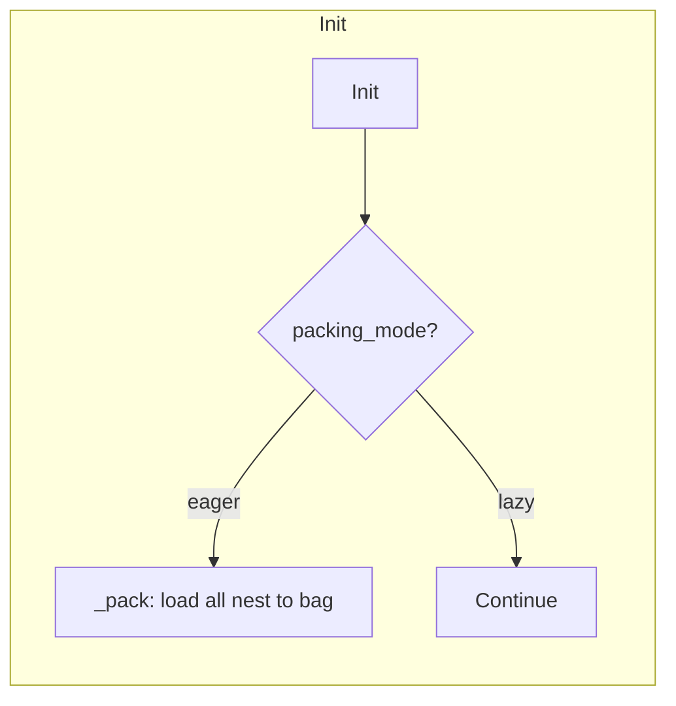

# Data flow
This page aims to explain how data is handled by the Raccoon class.

You might want to read the [glossary](glossary.md) first to get some concepts explained here.

## Object life cycle

### Initialization

